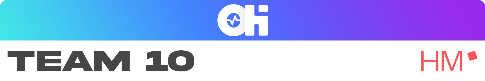

# About **Office Health**
Willkommen zum **Office Health** Repository.

Schon einmal von folgenden Problemen beim alltäglichen Bildschirmarbeiten gehört:  
- Rückenschmerzen  
- trockene Augenlieder 
- verspannte Muskeln 
- Konzentrationsstörungen 
- Motivationsprobleme  

Sehr wahrscheinlich schon! Mit dem Alexa Skill **Office Health** kann man diesen Problemen ganz einfach entgegen und vor beugen.  
Der Voice Assistent **Office Health** hilft dabei genug Bildschirmpausen in den Arbeitsalltag zu integrieren, erinnert an diese Pausen und macht mit dem User zusammen geeignete Übungen, um ihn fit und gesund zu halten. Diese Übungen können sich dabei in vom User ausgewählten Schwierigkeitsgrade, welche auch _Sweat Modes_ genannt werden, unterscheiden. 
Zudem hilf der Voice Assisent bei der Einteilung der Pausen, welche aber beliebig geändert werden können.  
Es gibt zwar bereits einige Health Assisten, doch **Office Health** zeichnet besonders die Interaktion mit den _Coaches_ aus. Dabei können die Coaches vom User beliebig gewählt und gewechselt werden. Diese Coaches unterscheiden sich nicht nur im Ton, sondern auch in der Persönlichkeit. So soll dem User einen Anreiz geben werden, den Voice Assistenen regelmäßig zu nutzen und ein gesünderes und zufriedenes Leben zu führen.

 

# About **Team 10**
Das Team 10 wurde für das **Projektmoduls Start**, des Studiengangs **Informatik und Design** der **MUC.DAI**, gegründet. Das Ziel des Projektmoduls ist ein interaktiven Voice Assistenten für Alexa in der Sprache _Python_ zu programmieren. Dabei sollte der Voice Assistent nicht redundant sein, einen Mehrwert haben und natürlich funktionieren.  
Die Arbeitsmethode und Aufgaben werden dabei in Sprints eingeteilt. Diese Sprints müssen in der vorgegebenen Zeit erfolgreich abgearbeitet werden.  
  
Unser Alphaversion wird im Rahmen des **Hi!A - Festivals** am 10.12.2021 um 16:30 Uhr in der Hochschule München für angewandte Wissenschaften vor Publikum vorgestellt. 

-----------------------------
Teil des Teams sind [_Melanie Bauer_](https://github.com/bauer30), [_Michael Buchholz_](https://github.com/m-m-mic), [_Isabella Deisinger_](https://github.com/IchIsabella), [_Eva Madl_](https://github.com/madlmaedl) und [_Alexander Sponholz_](https://github.com/Woodime)  

[GitHub](https://github.com/ID-Start-Winter21/start-team-10)  
[Wiki](https://github.com/ID-Start-Winter21/start-team-10/wiki)  
[miro](https://miro.com/app/board/o9J_llDuSkA=/)  
